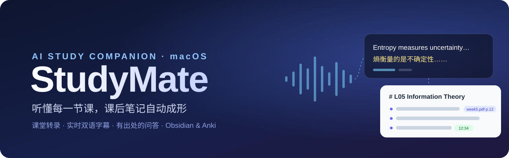
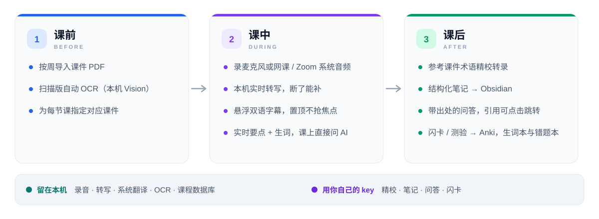

  

  

  
  
  
  

  <b>英文授课听不全？笔记记不过来？</b> 
  StudyMate 在你的 Mac 上实时转写课堂，叠一层双语字幕，下课后把录音、课件和你的随手笔记 
  整理成一份<b>每句话都能追溯出处</b>的笔记，再一键送进 Obsidian 和 Anki。

 

> [!NOTE]
> **1.1 更新**：可选 **Soniox 云端转写**，准确度大幅提升，还能**边说边翻**；新增课前术语表、继续录音、课程归档等功能。
> 看 **[更新日志](更新日志.md)** · 想用云端转写？看 **[Soniox 配置教程](Soniox配置教程.md)**

<table>
  <tr>
    <td width="50%" valign="top">
      <h3>🎧 实时双语字幕</h3>
      麦克风或网课 / Zoom 的系统音频都能录。本机免费转写，或用 Soniox 云端转写边说边翻；悬浮字幕置顶显示在任何应用和全屏之上。
    </td>
    <td width="50%" valign="top">
      <h3>🔗 有出处的问答</h3>
      基于课件和转录提问，回答里的出处都能点：课件翻到那一页，录音从那一秒开始播。
    </td>
  </tr>
  <tr>
    <td width="50%" valign="top">
      <h3>📝 课后自动整理</h3>
      课前从课件提取术语表；课后参考术语精校转录、按段落重新翻译，生成结构化笔记，按课程和周次写进 Obsidian。
    </td>
    <td width="50%" valign="top">
      <h3>🧠 复习闭环</h3>
      闪卡和测验导出 Anki，生词本、错题本，每门课一个复习中心。
    </td>
  </tr>
</table>

<picture>
  <source media="(prefers-color-scheme: dark)" srcset="assets/flow-dark.svg">
  
</picture>

## 下载与安装

**需要：** Apple 芯片的 Mac（M1 及以后）· macOS 26 及以上 · 一个模型服务商的 API key（默认 DeepSeek，也支持 OpenAI 兼容接口和 Anthropic）

1. 到 **[Releases](https://github.com/XingYujieee/StudyMate-Releases/releases/latest)** 下载最新的 `StudyMate-x.x-N.dmg`，双击打开，把 **StudyMate** 拖到 **Applications** 文件夹上
    下载 `.dmg` 不方便的话，同一页也有 `.zip`：解压后把 `StudyMate.app` 拖进"应用程序"
2. 第一次打开会提示"无法验证开发者"，点 **完成**，然后到 **系统设置 → 隐私与安全性** 拉到底部，点 **仍要打开**
3. 允许麦克风，在设置里粘贴你的 API key，选择 Obsidian vault（不用 Obsidian 可跳过）
4. （可选，推荐）开启 Soniox 云端转写，转写和翻译都更准：按 **[Soniox 配置教程](Soniox配置教程.md)** 操作，大约 3 分钟

> [!TIP]
> 找不到"仍要打开"？在终端运行 `xattr -dr com.apple.quarantine /Applications/StudyMate.app` 再双击打开。

完整步骤见 **[安装说明](安装说明.md)**。

## 更新

先退出 StudyMate，下载新版 `.dmg`，同样拖到 Applications，提示已存在时选 **替换**。课程、录音、转录、笔记都不会丢。

更新后如果遇到下面的情况：

| 现象 | 解决 |
| :-- | :-- |
| 录音没声音，或没弹出麦克风授权 | 系统设置 → 隐私与安全性 → 麦克风，删掉 StudyMate 后重新打开 |
| 弹出"想要访问钥匙串" | 输入开机密码，点 **始终允许** |
| 提示读不到 key、模型调用失败 | 设置 → API key → **重新填写 API key…**，清除后重新粘贴（用 Soniox 的话也要重新粘贴 Soniox key） |

每个版本改了什么，见 **[更新日志](更新日志.md)**。

## 隐私

录音、系统翻译、OCR 和你的课程数据都只存在你自己的 Mac 上；用默认的本机转写时，转写也在本机完成。API key 只存在系统钥匙串。
用到云端的只有这些，而且都用**你自己的 key**：精校、笔记、问答、闪卡会把本节课相关的文字发给你选的模型服务商；如果你选了 Soniox 云端转写，录音时音频会实时上传给 Soniox。
没有账号，没有服务器，没有统计上报。

## 关于测试版

这是邀请测试的早期版本，没有经过 Apple 公证，所以第一次打开需要手动放行。遇到问题或有建议，欢迎在 [Issues](https://github.com/XingYujieee/StudyMate-Releases/issues) 里反馈，附上截图和操作步骤最好。

本仓库只用于发布安装包，不包含源代码。

 

  Made for the lecture hall · 本机优先，你的课堂只属于你

